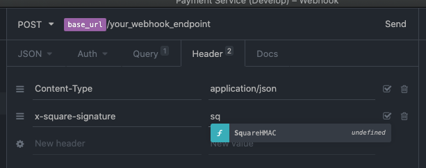
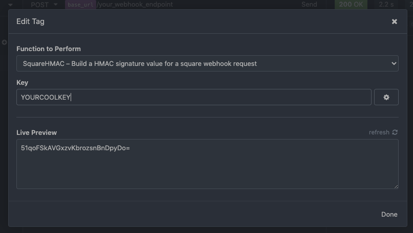

## square-signature-hmac-plugin

This is an insomnia plugin for testing endpoints that respond to Square webhook POST requests and perform request signature verification.

### Rationale

If the endpoint under test is performing signature verification, it can be difficult to post test data to verify correct behaviour, as there is no simple mechanism to ensure that the request is signed according to square's hmac-based `url` + `requestbody` scheme.

This plugin can generate a correct signature based on the request body (when provided a valid key) which can be used as the `x-square-signature` header to satisfy signature verification checks.

### Installation

This is not available as a packaged plugin, from insomnia you will need to run:

`git clone git@github.com:shanehandley-lt/square-signature-hmac-plugin.git ~/Library/Application\ Support/Insomnia/plugins/square-signature-hmac-plugin`

Then reload plugins in insomnia via Preferences > Plugins > 'Reload Plugins'

### Usage

Add a `x-square-signature` header to your request and 'sq' and wait for the variable selection popup ([or press ctrl+space](https://support.insomnia.rest/article/40-template-tags))

Double click to variable and edit the Key to match the signature for your webhook.

The computed signature should be added to the request header value.

### References

- https://github.com/grunka/insomnia-plugin-request-body-hmac
- https://developer.squareup.com/docs/webhooks-api/validate-notifications
